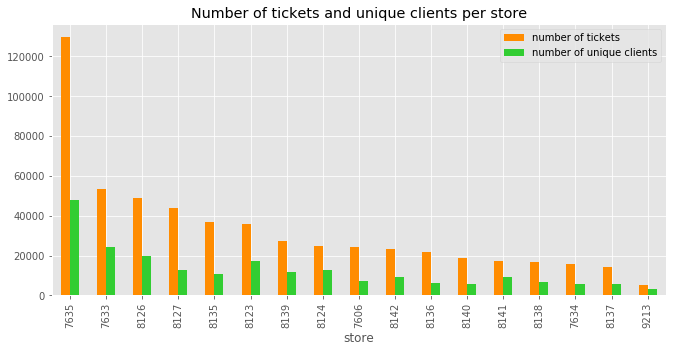
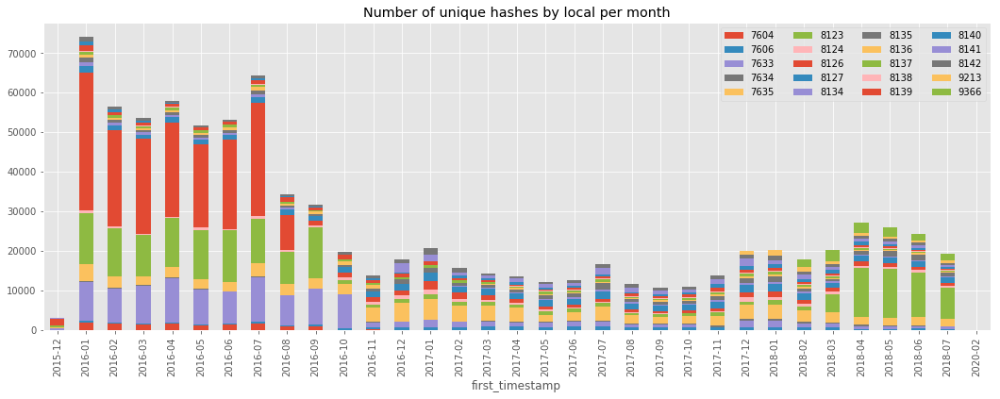

### Python Data exploration

Notebook on data exploration with Python using `pandas`, `numpy` `matplotlib` and `datetime` libraries. Analyzing temporal data about customer purchases and analytics.

------

#### Images

